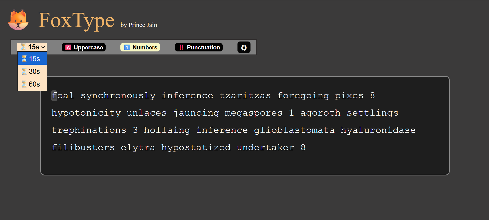
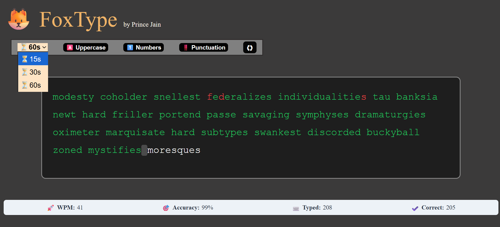

# FoxType 🦊⌨️

FoxType is a real-time typing speed test app built with **React + Vite**.  
It generates random words using the **Random Word API**, tracks typing speed (WPM), accuracy, and supports difficulty options (caps, numbers, punctuation).

## 🚀 Features

- Real-time typing test with WPM & accuracy tracking
- Batch word loading with persistent stats across refreshes
- Adjustable difficulty (uppercase letters, numbers, punctuation)
- Smooth text refresh once you finish a batch
- Responsive UI

## 🛠️ Tech Stack

- React + Vite
- JavaScript (ES6+)
- CSS3
- Random Word API

## 📸 Preview

Here’s how **FoxType** looks in action:




## 📦 Installation

1. Clone the repo:
   ```bash
   git clone https://github.com/<PrinceJain16>/fox-type.git
   ```
